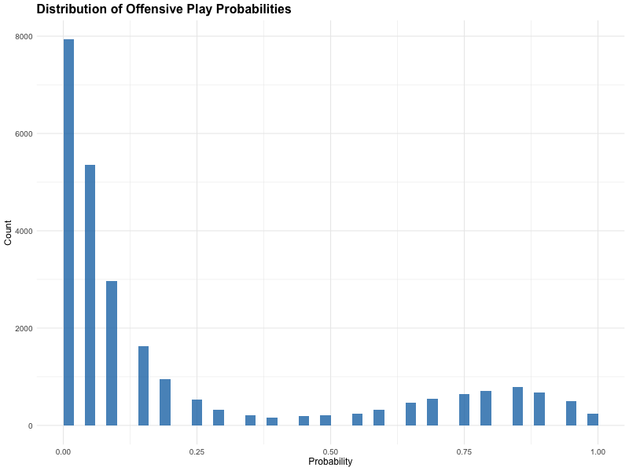
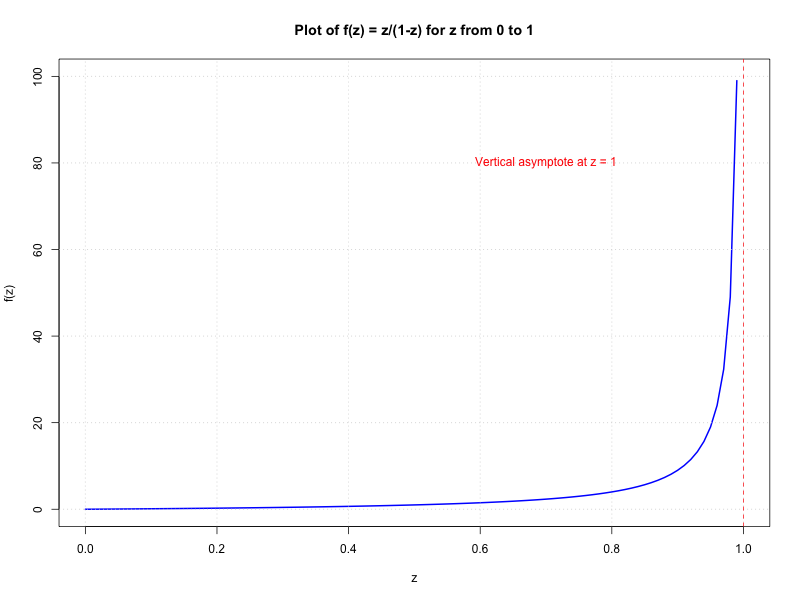
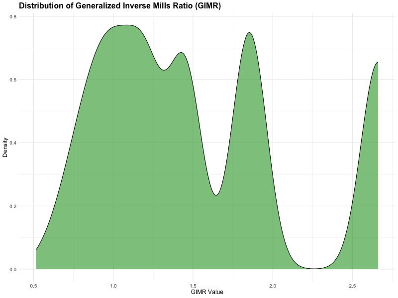
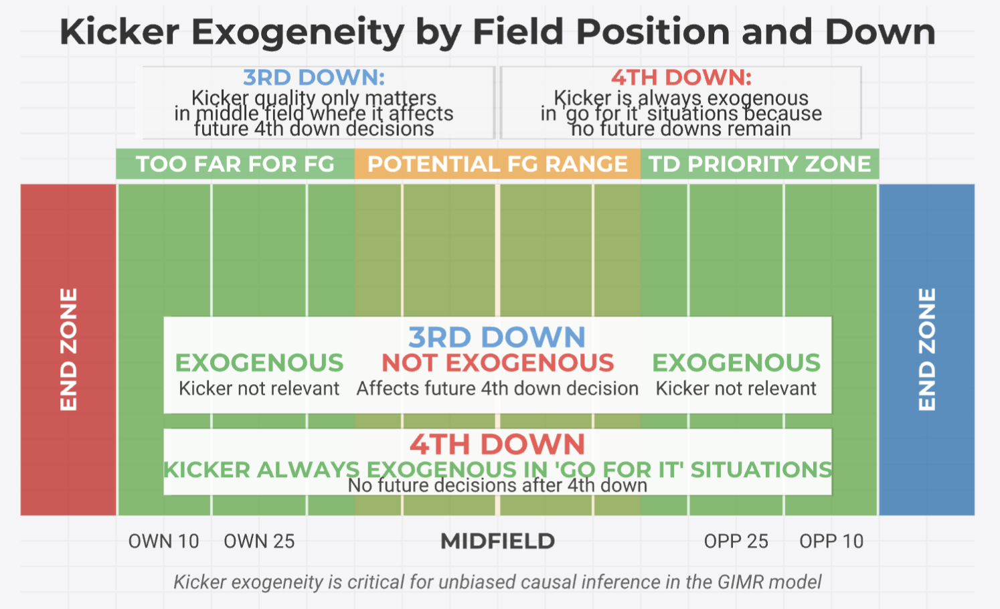

```{r setup, include=FALSE}
knitr::opts_chunk$set(echo=FALSE)
```

# Abstract
This research examines the critical decision-making process on fourth downs, focusing on whether coaches make optimal decisions based on player capabilities. Using a newly engineered dataset that incorporats detailed player statistics from 2017-2023, we analyze the causal and predictive factors influencing fourth down decisions and outcomes. Our Generalized Inverse Mills Ratio reveals coaches factor in unobserved variables during fourth down decisions and properly evaluate player performance in these situations. However certain player archetypes, such as quarterbacks that excel in short passes, are not properly evaluated. We find significant impacts from other specific player positions, with offensive linemen showing strong joint significance on conversion but not on coaching decisions. The findings provide actionable insights for NFL coaches to identify key signals in fourth down situations and optimize player selection and team build for these critical plays.

# Keywords

NFL, decision making, fourth down, player analysis, selection bias

# Introduction

## Context

The National Football League is a multi-billion dollar industry that has seen rapid growth within the American and international entertainment industry. This growth has placed more and more importance on the performance of NFL teams as they fight to win games to increase the popularity of their team as Davis and End (2010) argue that successful NFL franchises have measurable economic impacts on their local areas. This revelation has given rise to an age of data analytics in the NFL as teams seek to gain competitive advantages over their rivals. General managers and coaches then explore various strategic avenues.

In the NFL, a team's offensive possession is structured around a series of four "downs" where they attempt to advance the ball at least 10 yards to earn a new set of downs and maintain possession. When a team reaches fourth down without achieving the needed yardage, they face a pivotal decision. Teams typically choose between three options: punt the ball to establish favorable field position for their defense, attempt a field goal if within reasonable range (worth 3 points), or "go for it" by running an offensive play to try and gain the required yardage. For many years in the NFL there seemed to be a consistent standard that when faced with a fourth down your team will kick a field goal or punt the ball for better field position. The only exception being the dying moments in a game when teams are desperate for a miracle. 

In American Football many teams have shifted to being more aggressive on fourth down. Most famously are the Detroit Lions. Since the arrival of their current head coach Dan Campbell, the Lions adopted an aggressive strategy to match their aggressive “biting off knee caps” mentality (Birkett, 2023). While the Lions have seen success for the first time in years, they have also been criticized for their aggressive play calling. This was highlighted in the 2023-24 playoff divisional round game in which the Lions failed a fourth down attempt that was painted as unnecessary (Sporting News, 2024). After this mid-game failure there seemed to be a shift in momentum and the Lions lost the game.

## Research Problem and Key Findings

A result like this causes one to ask the question “Did the Lions make the right call?”. This question seems to be getting answered as “yes” by the current literature. However, we need to know if different teams should "go-for-it" or not "go-for-it" depending on their situation and team make-up. It could be argued that the Lions should have attempted the crucial fourth down in the 2023-24 playoff divisional round game. However, if the Panthers (which were a significantly worse team) were in that situation, it could again be argued that they should not have been as aggressive. The logic stems from how the Panthers would have a worse chance of being able to convert on fourth down due to a lack in player quality.

We must be wary of any recommendation that is given to a head coach. The truth is that we are not on the field, in the locker rooms, or in team meetings. This means coaches may know more then us in certain game time decision. We must approach this topic with the idea of being more practical and clear to coaches. If we are simply pointing our algorithms and giving black-box predictions we lose all credibility as one would be oblivious to the true depth of decision making in the NFL.

In our analysis we discover via our Generalized Inverse Mills Ratio that coaches are able to factor in variables that are unseen in our data in the decision making process on fourth downs. Coaches also show signs of being able to properly evaluate the performance of players in fourth down situations. However, certain archetypes of quarterback are not being properly evaluated and factored into decision making by coaches. Other positions such as offensive linemen, running backs, tight ends, and linebackers are also not being properly assessed by coaches on these "last chance" attempts.

## Research Questions

This leads us to have a need to answer some key questions about fourth downs in the NFL. First, are coaches in the NFL actually better at making these decisions than analysts? Second, is there any predictive power in the performance of players? The type of data we have created and work with is incredibly detailed and the first of its kind. One would ask if practical applications of this method could be used in decision making. Finally, do these key variables about players have a causal effect on the outcome of fourth down attempts? Answering these questions will allow coaches to look for key signals in fourth down situations and to know which players to start on that fourth down if it is decided to attempt. This also can be applied in discovering specialty players that are overlooked due to poor performances in situations that are not similar to fourth down.

# Literature Review

## Coach's Decision Making

Much discourse revolves around the idea that NFL coaches are acting overly averse to risk, which is lowering their expected wins. Romer (2006) found that teams had begun to move towards a more conservative or safe strategy in the NFL. He argues that teams value successful gambles more than the expected win percentage in a game. He theorizes that the poor decision making is either due to risk aversion or it is due to poor information.

To further this point using matching analysis, Yam and Lopez (2018) quantified this conservative decision-making, finding that teams could gain approximately 0.4 wins per year by being more aggressive on fourth downs.

Goff and Locke (2019) found when revisiting Romer’s framework that Romer’s core findings are still held to be true. However, they argue that overly conservative calls are not due to poor decision making. Instead they point to risk aversion as they estimate that coaches are willing to give up two-thirds of an expected point to avoid the uncertainty of fourth down attempts.

On top of this, there seems to be evidence that coaches are more cautious when their job is on the line. Owens and Roach (2018) found that in the NCAA coaches are relatively more conservative when they are more likely to be fired. At the same time they found when a coach was likely to be promoted they behave more aggressive then normal.

## Momentum

If a team feels to be “on fire” should they be more aggressive since they feel they have momentum? A important area of literature is the fallacy of the “hot hand”. The hot hand is a cognitive bias that leads people to believe that a person who has a successful outcome is more likely to have a successful outcome in future attempts. Gilovich et al. (1985) investigated the “hot hand” and “shooting streaks” in basketball. They found that both players and fans believed in the fallacy despite shots being independent of each other. Losak et al. (2023) similarly discovered that fantasy baseball users gravitated towards “hot” players. At the same time they were unable to identify a viable hot hand strategy in DraftKings DFS baseball.

Despite these common findings in other sports, there does seem to be some evidence of momentum existing in the NFL. Roebber et al.(2022, p. 2) defined momentum in the NFL as “the sustained increase in win probability by a single team over the course of at least 2 successive changes in possession”. With this definition, they found that streaks of win probability in football are non-random and are in fact predictable with Artificial Neural Network Models.

Lehman & Hahn (2013) looked to identify momentum across and within games in the NFL. Within-period momentum was found to encourage teams to take more risks. Negative within-period momentum was in turn found to encourage teams to take less risks. It was also discovered that across-period momentum has an effect only until a within-period momentum was established in a game

## Research Gaps

A gap in the current research is caused by the lack of quality data. Currently we observe many studies include team-aggregated grades or summary statistics about teams that are playing against each other. While some situations can allow this, our non-parametric models will be able to handle data with thousands of different variables. To take advantage of this, we will have information about every single player that is on the field when the ball is snapped. This will allow us to have better prediction power then previous researchers. These non-parametric models will also allow us to discover key player specific variables that can allow for further causal inference with specific on-field positions.

# Data

## Sources

Our data was pulled from two main sources. 

As a base the nflverse package provided in R gave us play-by-play data for the years of 2017 to 2023. This includes basic game information and the IDs of players that participated each play. The reason for our cutoff of 2017 is due to the NFL only putting tracking chips in players' jerseys as of the 2016 season. The 2016 season however still had many inconsistencies which leads us to drop the year. 

The key part then is the merging of Pro Football Focus's aggregated weekly data. The statistics are downloaded as premium player reports on a weekly basis and then aggregated to time lengths of 2 weeks, 12 weeks and 3 years. These time lengths have been arbitrarily picked which leaves room for future research. It was found that the 12 week time frame better captured the significance and value of players. This is due to the 2 week timeframe struggling with noise while the 3 year timeframe is not sensitive enough to emerging or aging players.

Players from the PFF data set were merged into our base play by play data set based on a 12 step algorithm that matched different player IDs accross the two sources. The steps included pre-match ids, and then was followed by matches based on names, teams and positions etc. 

As a final note attendance data was also scraped from Pro Football Reference. This data was then merged into our base data set to allow for the control of fan attendance in our models.


```{=latex}
\begin{table}[H]
\centering
\caption{Key Data Summary}
\includegraphics[width=\textwidth]{table_images/sum1.png}
\end{table}
```


## Variable Selection

Our variables that we work with fall into one of two categories. They are either statistics about players or about the situation of the play. The player variables consist of variables that describe who was on the field. We also have access to player variables of the starting players on each team based on depth chart data provided by nflverse. In both situations the players are sorted into columns based on depth chart position. For example, the starting QB (offense_player_1) is always in the starter_offense_player_1 slot to allow us to maintain consistency. Obviously our attempt models are forced to only use the starter player statistics as we cannot use the players on the field to predict the type of play that was called.

# Methodology

## Tools

The following models include several categories of control variables: *Game Situation Variables* capturing tactical contexts like distance needed, timeouts remaining, and time factors; *Coach Variables* reflecting experience, tenure, background, and historical decision patterns; *Team Stats* measuring performance metrics, efficiency ratings, and formation tendencies; *Season FE* controlling for organizational factors unique to each team-season combination; *Coach FE* isolating individual coaching philosophies and tendencies; *Player Presence* binary indicators tracking which specific players or positions are on the field; *Control Def. Players* accounting for defensive quality, positioning, and scheme; and *Control Off. Players* measuring offensive personnel capabilities and skill ratings. 

Tools that have both predictive and causal traits are being employed.

### Predictive Models

After filtering out column with too many NA Values (at a threshold of 20 %) we maintain 50,000+ different player variables. This clearly is a situation where predictive tools such as Random Forest and XGBoosting thrive. In the use of XGBoost we first use boostrapping to tune for optimal hyperparameters. Second we will run the tuned model on 1000 train/test bootstrapped splits of data to report the Area Under the Receiving Operator Curve (AUC). This process will be done when predicting attempts and conversion.

Similarly we can enact Random Forest to receive an Out-of-Bag AUC. Random Forest will also let us receive insight into what variables have high importance in predictions based on MDA and MDI. This ranking of variables not only allows us to feature select for XGBoosting but it also assisted in watching what variables could be considered for causal analysis.

### Causal Models

For the causal analysis we will be employing a form of the Heckman correction. This is due to the selection bias in fourth downs. Since not all fourth downs are attempted, we do not have data on the fourth downs that never happened. We look to deal with this bias by using an evolved verison of Heckman's original model. In the original paper, it was proposed to use a two step process. In the selection step one would predict the probability of being selected while including a variable that is exogenous to the actual outcome that we are interested in. This estimated probability is then converted into the IMR and used to control for selection bias in the outcome step. This process however assumes linear relationships in the selection stage.

In our case we are in fact not dealing with linear relationships in the selection stage. This was discovered by how we have a increase of almost 20 %pts in AUC when predicting attempts with a XGBoost model instead of a linear model. Therefore our first step in correcting selection bias looks to predict the probability of an attempt of a fourth down. This prediction then is converted into a Generalized Inverse Mills Ratio that is not bound to the classical assumptions of Heckman's original IMR. We then place our GIMR in our outcome equation when estimating the conversion of a fourth down to control for selection bias. 

## Framework

### Selection Model

Model the binary choice to attempt a play:

\begin{equation}
\text{Attempt}_i = \begin{cases}
1 & \text{if play is attempted} \\
0 & \text{if play is not attempted}
\end{cases}
\end{equation}

The probability is modeled as:
\begin{equation}
z_i = \text{RF}(\mathbf{X}_i, \mathbf{K}_i, \mathbf{P}_i)
\end{equation}

The distribution of z is:

```{r, out.width="100%"}

```

where:
\begin{itemize}
\item $z_i$: predicted probability of attempt
\item $\mathbf{X}_i$: covariates excluding kicker and punter grades
\item $\mathbf{K}_i$: kicker grades (exogenous)
\item $\mathbf{P}_i$: punter grades (exogenous)
\end{itemize}

The Generalized Inverse Mills ratio is:
\begin{equation}
\lambda_i = \frac{\phi(z_i)}{1-z_i}
\end{equation}

```{r, out.width="100%"}

```

This functional form shifts the weights to emphasis situations where the probability of attempting a play is close to 1. We call this ratio "Generalized" because it is not bound to the classical assumptions of Heckman's original IMR. This is because the selection model does not contain latent variables and rather is non-parametric.

The first and second order conditions for $\lambda_i$ are:

\begin{align*}
\frac{d\lambda}{dz} &= \frac{\phi(z)(z^2-z+1)}{(1-z)^2} > 0 \\
\frac{d^2\lambda}{dz^2} &= \frac{\phi(z)[-z^3+2z^2-2z+3]}{(1-z)^3} > 0
\end{align*}

Thus $\lambda_i$ is strictly increasing and convex in $z_i$.

### Outcome Model

Model the binary conversion outcome for attempted plays:

\begin{equation}
\text{Convert}_i = \begin{cases}
1 & \text{if attempt is successful} \\
0 & \text{if attempt fails}
\end{cases}
\end{equation}

The inputed GIMR then has the following distribution:

```{r, out.width="100%"}

```

Linear probability model with selection correction:
\begin{equation}
P(\text{Convert}_i = 1|\mathbf{X}_i,\lambda_i) = \mathbf{X}_i\boldsymbol{\beta} + \theta\lambda_i + \varepsilon_i
\end{equation}

where:
\begin{itemize}
\item $\mathbf{X}_i$: covariates excluding kicker and punter grades
\item $\lambda_i$: generalized inverse Mills ratio
\item $\boldsymbol{\beta}$: coefficient vector for main covariates
\item $\theta$: selection correction parameter
\item $\varepsilon_i$: error term with HC1 robust standard errors
\end{itemize}

Note: Kicker grades ($\mathbf{K}_i$) and punter grades ($\mathbf{P}_i$) serve as exogenous variables in the selection equation but are excluded from the outcome equation for identification.

Models are estimated separately for offensive outcomes (grades, yards, completions) and defensive outcomes (stops, grades, tackles).


# Results

## Exogeneity of Kicker and Punter Grades

  A key feature in our sample selection correction model, is the exogeneity of a variable that influences the selection equation. In American Football there is the luxery of using third down conversions as a selection bias free area. This is due to how conditions such as desperation or play calling cause a third down to be treated similarly to a fourth down by coaches. A fourth down is a teams last attempt for that offensive drive. While not in all, there are many cases of third down provide the similar conditions in terms of the coaches decision making. For example if the ball is on a teams own 20 yard line and they are on third and 10, the coach will treat this attempt as a "last chance". This is due to the fact that if the team does not convert on third down they will be forced to punt the ball. There is no situation here where the team can even consider kicking a field goal.

  We can first note that the grades of a teams kicker is positively significant in it's effect on the decision to attempt a fourth down. Exogenity of the kicker is now required in the case of the outcome of fourth downs. 
  
  When the kicker is not on the field during a fourth down they are unable to effect the decision making of the coaches or plays of the coaches, as there are no further decisions to be made. In a Third down situation we find that kicker grades do have positive significance on the conversion of a third down. This significance, is solely found in the middle of the field, where the kicker is more likely to be used if the third down is not converted. In the situations on third down that would mirror a fourth down, there is no statistical significance. When the kicker is not a part of the decision making process on third down, similarly to fourth down, it does not have an effect on third down conversion. 
  
```{=latex}
\begin{table}[H]
\centering
\caption{Kicker Offensive Grades}
\includegraphics[width=\textwidth]{table_images/kick1.png}
\end{table}
```

This significance of the kicker and punter grades in key areas of the field is due to the coaches being able to properly adjust their decision making for whether or not to attempt a fourth down. This is to say that coaches are properly recognizing how good or bad both their punters and kickers are and making adjustments on their playcalling. 

```{r kicker-plot, fig.cap="Kicker Plot", out.width="100%"}

```

As a note while punters do not show signs of significantly affecting the fourth down attempt probability, they are included. The logic for them remains the same as the kickers and therefore there is no harm in including them in the selection model. 


## Generalized Inverse Mills Ratio (GIMR)

In examining the following tables one can see significance of our GIMR is confirmed. This tells us that coaches in the NFL see factors that we cannot and act on them in the proper way. When a coach is more likely to attempt a fourth down conversion attempt that they are then also more likely to convert that fourth down attempt due to unseen variables. The GIMR also allows for bias free interpretation of the marginal effects of variables across models.

## Player Analysis

### Pretense

The exogeneity of kicker grades allows a bias-free analysis of individual players and coaches. Players are evaluated in terms of their performance in the 12 week timeframe. This time frame is arbitrary and can be a source of future research with how to optimize the measurement of player values. 

Players that are used are either "On-Field" or "Starter" players. On-field players are players that are on the field during the fourth down attempt. Starter players are the players that are listed as the starter on the depth chart. In both situations players are sorted via depth chart postings.

For each of these categories we then create models that focus on either offensive of defensive players. If an offensive model is ran we select multiple features about each player on the offense while keeping one key feature of each defensive player. The opposite is done for the defensive model.

The offensive and defensive models are both measured in three different ways. For offensive models we measure by PFF grades, completions/receptions and yards. For defensive models we measure by PFF grades, stops and tackles. For our current work we will use PFF grades for our main analysis due to it's ability to capture the overall performance of a player in a specific area. The other measures will be kept as robustness checks.

To evaluate coaches' decision making, the attempt models are able to show if a coach is properly deciding to attempt a fourth down based on features of players that influence the conversion of a fourth down. 

### Offensive Player Grades Model Results

The following tables displays the results of the Offensive Player Grades Models across LPM, probit and logit models.  

```{=latex}
\begin{table}[H]
\centering
\caption{Offense Grades Table}
\includegraphics[width=\textwidth]{table_images/off1.png}
\end{table}
```

It is found that the effect of an on-field quarterback is positively significant across all model types. This finding exemplifies how quarterbacks that excel in passing the ball on quicker routes perform better on fourth downs. Contrary to this a starting quarterback's grades are not significant in the decision making of coaches whether to attempt a fourth down. This is to say that the coaches fail to properly factor in the specific archetypes of quarterback that their team possesses. While the strength of significance with the starter versions of the models is weaker, the following table 4 cannot find a statistically significant difference between the marginal effects of the on-field and starter short passing grades for quarterbacks. However, there is a statistical different between the on-field marginal effects for quarterback grades and the attempt models' marginal effects of quarterback grades.

Similarly we see the Tight End 1 slot shows significance at a p-value of 0.05 in both on-field and starter models in terms of their pass blocking grades. The further lack of any positive significance in terms of a Tight End's pass catching grades tells us that a tight end's ability to block is more important then their ability to catch the ball in fourth down situations. Similarly to Quarterbacks, the coaches fail to properly factor in the specific archetype of tight end that their team possesses as there is a lack of significance within attempt models.

The positive signs of significance of running back grades in our attempt models suggests that coaches will factor in a running back in a fourth down situation. This checks out intuitivly as the ball is often run on fourth down and the running back would appear to be a key player in running the ball. However there is a lack of significance of the running back on the actual conversion of the attempt on fourth down. To support this the offensive linemen we will see show strong joint significance on conversion and not on attempt decisions. This suggests that coaches are overly focusing on the skill of their running back rather then the skill of their linemen.


```{=latex}
\begin{table}[H]
\centering
\caption{Offense Grades Differences Table}
\includegraphics[width=\textwidth]{table_images/off1.5.png}
\end{table}
```

The following tables display joint significance of the Offensive Player Grades Models across LPM, probit and logit models. Here they are grouped by position groups. This analysis is useful in the case of where a position has multiple players that are on the field of that position. For example, the offensive line has 5 players that are on the field at once. In our data we generalize the positions of these players from positions like left tackle, left guard, center, right guard and right tackle to avoid data loss when matching players into there designated slots. For example if an on-field left tackle where to play a snap at left guard this would create a missing value when we look to match a player to their respective column. This same logic applies for the defensive players as well.

While this generalization creates a loss of position tracking in our individual models, we still can use the joint significance to extract meaningful causal inferences. For example we can observe how the Starter models find signifiance with the offensive line as a whole. The offensive line grade's are missed by coaches in their attempt models.

```{=latex}
\begin{table}[H]
\centering
\caption{Offense Grades Model Results}
\includegraphics[width=\textwidth]{table_images/off2.png}
\end{table}
```

In our last set of offensive F-values tables, we find that our starter models show significance for our entire offense as a whole. This is consistent across our robustness checks when models are ran with yards and completions as well. Attempt models then show no indication of the offensive players jointly having a influence on the attempt of a fourth down.

```{=latex}
\begin{table}[H]
\centering
\caption{Joint Significance Offense}
\includegraphics[width=\textwidth]{table_images/off3.png}
\end{table}
```

### Defensive Player Grades Model Results

Our defensive players individually suffer relatively more from positions being generalized. This is caused by how all positions on defense have many but small differences. However one result can be found with the starting linebackers of a team in a model that measures the effect of linebackers zone coverage grades on the decision to attempt a fourth down. The LB1 and LB2 both have nearly identical negative marginal effects in this matter. With coaches allowing this effect on their decision making it is then concerning to find that the LB1 and LB2 zone coverage grades are not significant in the actual conversion of a fourth down attempt.

```{=latex}
\begin{table}[H]
\centering
\caption{Defense Grades Table}
\includegraphics[width=\textwidth]{table_images/def1.png}
\end{table}
```

```{=latex}
\begin{table}[H]
\centering
\caption{Defense Grades Differences Table}
\includegraphics[width=\textwidth]{table_images/def1.5.png}
\end{table}
```

The joint significance, found in the following table, of defensive players by position also shows significance with linebackers in our attempt models. This significance is once again not picked up in any way by our starter or on-field models. However Cornerbacks are significant at a p-value of 0.01 in both on-field and starter models. Finally, There is no evidence of cornerbacks effecting attempt probability.

```{=latex}
\begin{table}[H]
\centering
\caption{Defense Grades Model Results by Position Groups}
\includegraphics[width=\textwidth]{table_images/def2.png}
\end{table}
```

Across our different robustness checks models we find that the defensive players as a whole are significant in our starter models that measure with grades and stops. This is not the case for our on-field models or our tackles model. While our tackles models lacking significance is not surprising, as it is a different type of statistic compared to stops and grades, we find once again that on-field measurements lack significance. 

```{=latex}
\begin{table}[H]
\centering
\caption{Joint Significance Defense}
\includegraphics[width=\textwidth]{table_images/def3.png}
\end{table}
```

The interpretation of starter and on-field models leads us to ask why there is a difference in quality of statistical significance. In our F-Statistic tables starter models appear to capture the performance of positions and teams better. Individual player features also seem to measure player performance better as show by a larger amount of significant variables. This leads us to believe that starter models have less noise in measurement then on-field models due to a higher consistency of players. On-field measurements are subject to players being subbed in and out of the game. While it provides greater detail in measurement it makes player slots have more variance in terms of which players are present where. For example the LB2 of a team can be slotted into either LB slot 1 or 2 depending on the availability of the LB1 in an on-field play. However for a given game that LB 2 player will stay in the second slot for the entire game. 

Our second explanation is that the starter measurements capture more about the culture, makeup and coaching of a team. If a team has "better" players they are more likely to convert a fourth down due to the skill of the players on the field but also from the experience that is passed onto other athletes. Similar to this there is more information about a team for the starter columns. This is because the "starters" of a team can be much more then just eleven players on offense and eleven players on defense. This is due to the variation in offensive but especially defensive formations.

### Predictive Algorithms

In the following predictive analysis we have two main questions. First, are the conversions on fourth down predictable and do player specific factors help this process? Second do starter or on-field statistics contain more predictive power? The following figure displays the results of our XGBoosting algorithm in predicting the result of a fourth down attempt. The model was tested on 1000 bootstrapped test data sets after hyperparameters where tuned. 

To answer our first question we create models that are run engineered datasets that went through different "rounds". The data initially is the top 50 base columns, based on MDA, that have no player specific information. So our round 0 dataset is lacking of any player specific information. As rounds are added it grabs one the best variable, by MDA, for each positional slot. So the round 1 dataset has one variable describing the QB1 position, the round 2 dataset has two variables describing the QB1 position and so on.

```{=latex}
\begin{figure}[H]
\centering
\caption{Predictive AUC}
\includegraphics[width=\textwidth]{auc_test_distributions_combined.png}
\end{figure}
```

An AUC hovering around 0.7 is quite valuable when we consider the context of what we are predicting. What is most encouraging however is we see that AUC of algorithms that possess player colums (rounds 1, 2 and 5 datasets) all consistently perform better then the AUC of the datasets that do not contain player columns (round 0 dataset). 

The following two sets of tables compare selection and outcome models when run with tuned XGBoosting on data that uses just on-field player statistics vs starter player statistics.

\begin{table}[H]
    \centering
    \caption{Comparison of Selection and Conversion AUCs for different models}
    \label{tab:combined_aucs}
    
    \begin{subtable}{\textwidth}
        \centering
        \includegraphics[width=\textwidth]{selection_models_comparison.png}
        \caption{Selection AUCs}
        \label{tab:selection_aucs}
    \end{subtable}
    
    \vspace{0.25cm}
    
    \begin{subtable}{\textwidth}
        \centering
        \includegraphics[width=\textwidth]{conversion_models_comparison.png}
        \caption{Conversion AUCs}
        \label{tab:conversion_aucs}
    \end{subtable}
\end{table}

From the previous tables we can reason that in terms of pure predictive power there is little difference in the AUC of the starter and on-field models. This highlights a need for further work as we are finding little to no difference in the predictive power of the two models but a difference in the statistical significance of the of the methods.

## Discusion

In revisiting our original research questions we find encouraging but mixed answers to our questions. Our Generalized Inverse Mills Ratio is significant which both confirms selection bias (that we correct for) and tells us that coaches are able to factor in variables that we cannot see in our data. This is in line with theory, as we would imagine that coaches know their teams better than we do and therefore make better decisions. Our analysis of third down situations further supports this. It is found that kicker grades significantly impact third down play calling, particularly in the middle of the field where field goal attempts become viable if the third down fails. This demonstrates coaches' consideration of special teams abilities in their offensive decision-making, even before reaching fourth down. Despite this awareness, decision makers in the NFL are not perfect and fail to identify key archetypes of players such as Quarterbacks that excel in short passing. While a team can decide to simply adjust their decision making based on their own and opposing players, they also have the option of building a team to specifically excel in these situations. This would look like searching for Tight Ends that specifically excel in pass blocking or shifting the focus of the run game from the running back to the offensive line.

# Future Research or Improvments

In the selection of what timeframe to use for the measurement of player performance we initially tested with the lengths of 3 weeks, 12 weeks and 3 years. It became very clear that the 12 week measure strikes the best balance between being sensitive to trends and avoiding noise generally. However, there should also be research on what the best time frame for measuring the quality of a player is. 

The biggest question that needs empirical answering is why the starter player measurements capture more statistical significance then the on-field measurement techniques. While some initial work has been done here, this is a scenario in which theory and robustness checks must be employed.

Crowd attendance impact also can be further explored. We currently have relatively prepared data. This can be analyzed in different levels of coaches decision making as the 2020 pandemic provides a perfect situation to experiment within.

One player doing well may make the other players perform well or poorly (depending on position). For example if a WR1 is very talented they may be targeted by the defense to be "shut-down" similar to New England's defense when Bill Belichick was the Head Coach. In this case the WR2 has an easier time than normal. Now this also has applications with quality of players brought on as if one player "gets paid" then that effects the rest of the team in terms of what players can be brought in due to budgetary issues.

Momentum is brought up in the literature review but it is not a key focus of the paper. More work can certainly be done here however. For example keeping w3 and w12 grades will tell a story about recent performance.

\newpage

# References

[Back to Table of Contents](#table-of-contents)

\label{cook2022}Cook, J. A. (2022). Sample-Selection-Adjusted Random Forests. International Journal of Data Science and Analytics, 14, 375-388.  http://dx.doi.org/10.2139/ssrn.4225014

\label{das2003}Das, M., Newey, W. K., & Vella, F. (2003). Nonparametric estimation of sample selection models. The Review of Economic Studies, 70(1), 33-58. https://doi.org/10.1111/1467-937X.00236

\label{gilovich1985}Gilovich, T., Vallone, R., & Tversky, A. (1985). The hot hand in basketball: On the misperception of random sequences. Cognitive Psychology, 17(3), 295-314. https://doi.org/10.1016/0010-0285(85)90010-6

\label{goff2019}Goff, B. L., & Locke, C. (2019). Revisiting Romer: Digging Deeper Into Influences on NFL Managerial Decisions. Journal of Sports Economics, 20(5), 673-694. https://doi.org/10.1177/1527002518798686

\label{heckman1979}Heckman, J. J. (1979). Sample Selection Bias as a Specification Error. Econometrica, 47(1), 153-161. https://doi.org/10.2307/1912352

\label{klein1993}Klein, R. W., & Spady, R. H. (1993). An efficient semiparametric estimator for binary response models. Econometrica, 61(2), 387-421. https://doi.org/10.2307/2951556

\label{lehman2013}Lehman, D. W., & Hahn, J. (2013). Momentum and Organizational Risk Taking: Evidence from the National Football League. Management Science, 59(4), 852-868. https://doi.org/10.1287/mnsc.1120.1574

\label{losak2023}Losak, J. M., Stenquist, R., & Lovett, M. (2023). Behavioral Biases in Daily Fantasy Baseball: The Case of the Hot Hand. Journal of Sports Economics, 24(3), 352-372. https://doi.org/10.1177/15270025221128955

\label{owens2018}Owens, M. F., & Roach, M. (2018). Decision-making on the hot seat and the short list: Evidence from college football fourth down decisions. Journal of Economic Behavior & Organization, 148, 226-245. https://doi.org/10.1016/j.jebo.2018.02.023

\label{roebber2022}Roebber, P. J., Schultz, D. M., & Colle, B. A. (2022). On the existence of momentum in professional football. PLOS ONE, 17(6), e0269604. https://doi.org/10.1371/journal.pone.0269604

\label{romer2006}Romer, D. (2006). Do Firms Maximize? Evidence from Professional Football. Journal of Political Economy, 114(2), 340-365. https://doi.org/10.1086/501171

\label{yam2018}Yam, D., & Lopez, M. (2018). Quantifying the Causal Effects of Conservative Fourth Down Decision Making in the National Football League. Available at SSRN: https://ssrn.com/abstract=3114242 or http://dx.doi.org/10.2139/ssrn.3114242

\label{carl2024}Carl, S., Baldwin, B., Sharpe, L., Ho, T., Edwards, J. (2024). nflverse. Play-by-play data for NFL games. Retrieved from [https://nflverse.nflverse.com/](https://nflverse.nflverse.com/).

\label{pff2024}Pro Football Focus (PFF). (2024). NFL Player Performance Data. Accessed via subscription at [https://premium.pff.com/nfl/teams/2024/REGPO](https://premium.pff.com/nfl/teams/2024/REGPO).

\label{sportingnews2024}Sporting News. (2024). Lions' Dan Campbell criticized for fourth-down decisions in playoff loss to 49ers. Retrieved from [https://www.sportingnews.com/us/nfl/news/lions-49ers-dan-campbell-fourth-down-decisions/b54ce7cc05c4d55fc7b46285](https://www.sportingnews.com/us/nfl/news/lions-49ers-dan-campbell-fourth-down-decisions/b54ce7cc05c4d55fc7b46285).

\label{davis2010}Davis, M. C., & End, C. M. (2010). A winning proposition: The economic impact of successful National Football League franchises. *Economic Inquiry*, 48(1), 39–50. https://doi.org/10.1111/j.1465-7295.2008.00124.x

\label{birkett2023}Birkett, D. (2024, January 21). On this date: Memorable kneecap speech. Sports Illustrated. Retrieved from https://www.si.com/nfl/lions/news/on-this-date-memorable-kneecap-speech

\label{stine1989}Stine, R. (1989). An Introduction to Bootstrap Methods: Examples and Ideas. Sociological Methods & Research, 18(2-3), 243-291. https://doi.org/10.1177/0049124189018002003 (Original work published 1989)
