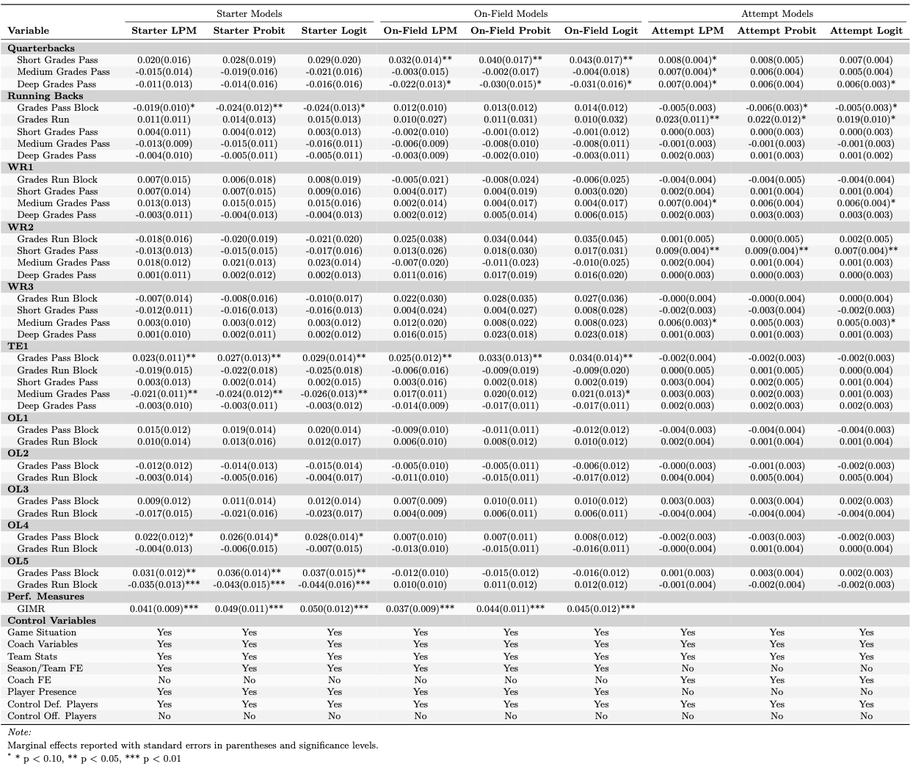
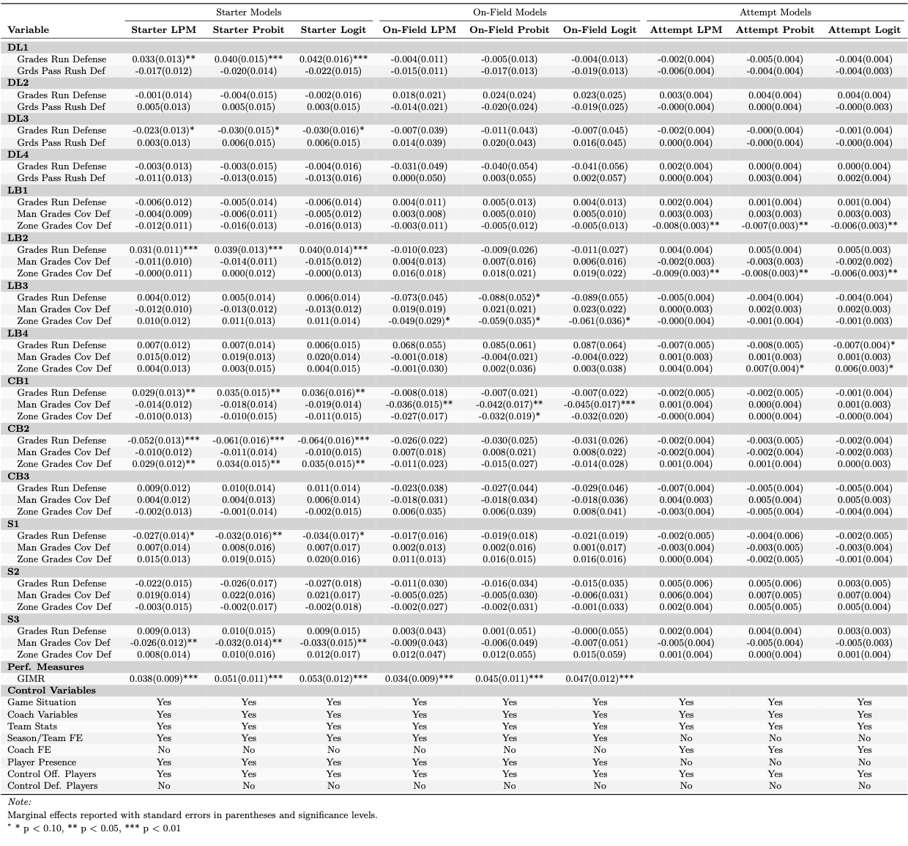
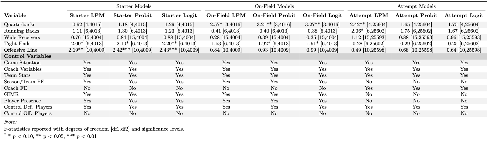
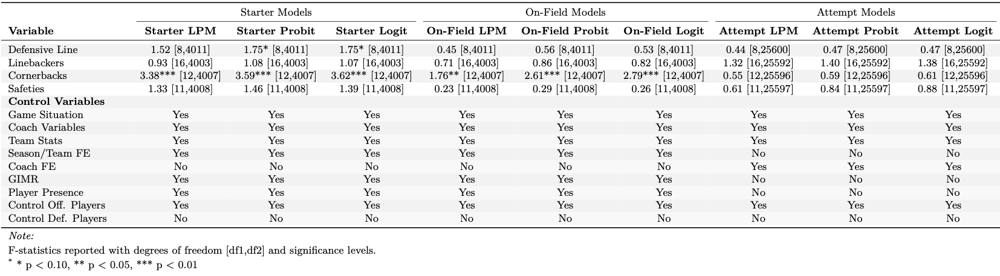

```{r setup, include=FALSE}
knitr::opts_chunk$set(echo=FALSE)
```

# Context

The National Football League is a multi-billion dollar industry that has seen rapid growth within the American and International entertainment . This growth has placed more and more importance on the performance of NFL teams as they fight to win games to increase the popularity of their team as Davis and End (2010) argue that successful NFL franchises have measurable economic impacts on their local areas. This revelation has given rise to a age of data analytics in the NFL as teams seek to gain competitive advantages over their rivals. GMs and coaches then explore different avenues of strategies.

In the NFL, a team's offensive possession is structured around a series of four "downs" where they attempt to advance the ball at least 10 yards to earn a new set of downs and maintain possession. When a team reaches fourth down without achieving the needed yardage, they face a pivotal decision. Teams typically choose between three options: punt the ball to establish favorable field position for their defense, attempt a field goal if within reasonable range (worth 3 points), or "go for it" by running an offensive play to try and gain the required yardage. For many years in the NFL there seemed to be a consistent standard that when faced with a fourth down your team will kick a field goal or punt the ball for better field position. The only exception being the dying moments in a game when teams are desperate for a miracle. 

In American Football many teams have shifted to being more aggresive on fourth down. Most famously are the Detroit Lions. Since the arrival of their current head coach Dan Campbell, the lions adopted a aggressive strategy to match their aggressive “biting off knee caps” mentality (Birkett, 2023). While the lions have seen success for the first time in years, they have also been criticized for their aggressive play calling. This was highlighted in the 2023-24 playoff divisional round game in which the Lions failed a fourth down attempt that was painted as unnecessary (Sporting News, 2024). After this mid-game failure there seemed to be a shift in momentum and the lions lost the game.

# Research Problem and Glimpse of Findings

A result like this causes one ask the question “Did the Lions make the right call?”. This question seems to be getting answered as “yes” by the current literature. However, we need to know if different teams should "go-for-it" or not "go-for-it" depending on their situation and team make up. For example, it could be argued that the lions should have attempted the crucial fourth down in the 2023-24 playoff divisional round game. However, if the Panthers (which were a significantly worse team) were is that situation it could be argued that they should not have been as aggressive. This is because the panthers could have had a worse chance of being able to convert on fourth down.

On top of this, we must be weary of any recommendation that is given to a head coach. The truth is that we are not on the field, in the locker rooms, or in team meeting. This means coaches may know more then us in certain game time decision. We must approach this topic with the idea of being more practical and clear to coaches. If we are simply pointing our algorithms and giving black-box predictions we lose all credibility as one would be oblivous to the true depth of decision making in the NFL.

In our analysis we discover via our GIMR that coaches are able to factor in variables that are unseen in our data in the decision making process on 4th downs. Coaches also show signs of being able to properly evaluate the performance of players in fourth down situations. 

# Research Questions

This leads us to have a need to answer some key questions about fourth downs in the NFL. First, are coaches in the NFL actually better are making these decision then analysts? Second, is what key variables about players have predictive power in fourth down attempts? In other words, are there players that are more important in fourth down situations when compared to other situations. Finally, do these key variables about players have a causal effect on the outcome of fourth down attempts? Answering these questions will allow coaches to look for key signals in fourth down situations and to know which players to start on that fourth down if it is decided to attempt. This also can be applied in discovering specialty players that are overlooked due to poor performances in situations that are not similar to fourth down.

# Liturature Review

Much discourse revolves around the idea that NFL coaches are acting overly averse to risk, which is lowering their expected wins. Romer (2006) found that teams had begun to move towards a more conservative or safe strategy in the NFL. He argues that teams value successful gambles more then the expected win percentage in a game. He theorizes that the poor decision making is either due to risk aversion or it is due to poor information.

To further this point using matching analysis, Yam and Lopez (2018) quantified this conservative decision-making, finding that teams could gain approximately 0.4 wins per year by being more aggressive on fourth downs.

Goff and Locke (2019) found when revisiting Romer’s framework that Romer’s core findings are still held to be true. However, they argue that overly conservative calls are not due to poor decision making. Instead they point to risk aversion as they estimate that coaches are willing to give up two-thirds of a expected point to avoid the uncertainty of fourth down attempts.

On top of this, there seems to be evidence that coaches are more cautious when their job is on the line. Owens and Roach (2018) found that in the NCAA coaches are relatively more conservative when they are more likely to be fired. At the same time they found when a coach was likely to be promoted they behave more aggressive then normal.


If a team feels to be “on fire” should they be more aggressive since they feel they have momentum? A important area of literature is the fallacy of the “hot hand”. The hot hand is a cognitive bias that leads people to believe that a person who has a successful outcome is more likely to have a successful outcome in future attempts. Gilovich et al. (1985) investigated the “hot hand” and “shooting streaks” in basketball. They found that both players and fans believed in the fallacy despite shots being independent of each other. Losak et al. (2023) similarly discovered that fantasy baseball users gravitated towards “hot” players. At the same time they were unable to identify a viable hot hand strategy in DraftKings DFS baseball.

Despite these common findings in other sports there does seem to be some evidence of momentum existing in the NFL. Roebber et al.(2022, p. 2) defined momentum in the NFL as “the sustained increase in win probability by a single team over the course of at least 2 successive changes in possession”. With this definition, they found that streaks of win probability in football are non-random and are in fact predictable with Artificial Neural Network Models.

Lehman & Hahn (2013) looked to identify momentum across and within games in the NFL. Within-period momentum was found to encourage teams to take more risks. Negative within-period momentum was in turn found to encourage teams to take less risks. It was also discovered that across-period momentum has an effect only until a within-period momentum was established in a game

# Gap in Current Research

A gap in the current research is caused by the lack in quality data. Currently we observe many studies include team-aggregated grades or summary statistics about teams that are playing against each other. While some situations can allow this, our non-parametric models will be able to handle data with thousands of different variables. To take advantage of this, we will have information about every single player that is on the field when the ball is snapped. This will allow us to have better prediction power then previous researchers. These non-parametric models will also allow us to discover key player specific variables that can allow for further causal inference with specific on-field positions.

# Roadmap 

Go over this

# Data Sources

Our data was pulled from two main sources. 

As a base the nflverse package provided in R gave us play by play data for the years of 2017 to 2023. This includes basic game information and the IDs of players that participated each play. The reason for our cutoff of 2017 is due to the NFL only putting tracking chips in players jerseys as of the 2016 season. The 2016 season however still had many inconsistencies which leads us to drop the year. 

The key part then is the merging of Pro Football Focus's aggregated weekly data. The statistics are downloaded as premium player reports on a weekly bases and then aggrigated to time lengths of 2 weeks, 12 weeks and 3 years. These time length have been arbitrarly picked which leaves room for future research. It was found that the 12 week timeframe better captured the significance and value of players. This is due to the 2 week timeframe struggling with noise while the 3 year timeframe is not sensitive enough to emerging or aging players.

Players from the PFF data set where merged into our base play by play data set based on a 12 step algorithm that matched ids accross the twos sources. The steps included pre-match ids, and then players matched on names, teams and positions. 

As a final note attendance data was also scrapped from pro football reference.


```{r off-p-sum, fig.cap="Player Offensive Summary", out.width="100%"}

```

```{r def-p-sum, fig.cap="Player Defensive Summary", out.width="100%"}
knitr::include_graphics("table_images/sum2.png")
```

```{r other-sum, fig.cap="Other Variable Summary", out.width="100%"}
knitr::include_graphics("table_images/sum3.png")
```

# Variable Selection

Our variables that we work with fall into one of two categories. They are either statistics about players or about the situation of the play. The player variables consist of variables that describe who was on the field. We also have access to player variables of the starting players on each team based on depth chart data provided by nflverse. In both situations the players are sorted into columns based on depth chart position. For example, the starting QB is also in the offense_player_1 slot to allow us to maintain consistancy. 

In our models to predict conversions in third or fourth downs we use the following base collumns:

Our models that are used to predict the attempt of a fourth downs conversion then use the following base collums:

Obvously our attempt models are forced to only use the starter player statistics as we cannot use the players on the field to predict the type of player that was called.

# Methodology and Tools

The following models include several categories of control variables: *Game Situation Variables* capturing tactical contexts like distance needed, timeouts remaining, and time factors; *Coach Variables* reflecting experience, tenure, background, and historical decision patterns; *Team Stats* measuring performance metrics, efficiency ratings, and formation tendencies; *Season/Team FE* controlling for organizational factors unique to each team-season combination; *Coach FE* isolating individual coaching philosophies and tendencies; *Player Presence* binary indicators tracking which specific players or positions are on the field; *Control Def. Players* accounting for defensive quality, positioning, and scheme; and *Control Off. Players* measuring offensive personnel capabilities and skill ratings. 

Tools that have both predictive and causal traits are being employed.

In our data we often had 20,000+ different player variables. This clearly is a situation where predictive tools such as Random Forest and XGBoosting thrive. In the use of XGBoosting we first use boostrapping to tune for optimal hyperparameters. Seccond we will run the tuned model on 1000 train/test bootstrapped splits of data to report the AUC. This process will be done when predicting attempts and conversion.

Similarly we can enact Random Forest to receive a OOB AUC. Random Forest will also let us receive insight into what variables have high importance in predictions based on MDA and MDI. This ranking of variables not only allows us to feature select for XGBoosting but it also assisted in watching what variables could be considered for causal analysis.

For the causal analysis we will be enploying the a form of the Heckman correction. This is due to the selection bais in fourth downs. Since not all fourth downs are attempted, we do not have data on the fourth downs that never happened. We look to deal with this bias by using a evolved verison of Heckman's original model. In the original paper it was proposed to use a two step process. In the selection step one would predict the probability of being selected while including a variable that is exogenous to the actual outcome that we are interested in. This estimated probability is then converted into the IMR and used to control for selection bias in the outcome step. This process however assumes linear relationships in the selection stage.

In our case we are in fact not dealing with linear relationships in the selection stage. This is discovered by how we have a increase of almost 20 %pts in AUC when predicting attempts with a XGBoost model instead of a linear model. Therefore our first step in correcting selection bias looks to predict the probability of a attempt of a fourth down. This prediction then is converted into a Generalized IMR that is not bound to the assumptions of a IMR. We then place our GIMR in our outcome equation when estimating the conversion of a fourth down to control for selection bias. 


\section{Step 1: Selection Model}

Model the binary choice to attempt a play:

\begin{equation}
\text{Attempt}_i = \begin{cases}
1 & \text{if play is attempted} \\
0 & \text{if play is not attempted}
\end{cases}
\end{equation}

The probability is modeled as:
\begin{equation}
z_i = \text{RF}(\mathbf{X}_i, \mathbf{K}_i, \mathbf{P}_i)
\end{equation}

where:
\begin{itemize}
\item $z_i$: predicted probability of attempt
\item $\mathbf{X}_i$: covariates excluding kicker and punter grades
\item $\mathbf{K}_i$: kicker grades (exogenous)
\item $\mathbf{P}_i$: punter grades (exogenous)
\end{itemize}

The generalized inverse Mills ratio is:
\begin{equation}
\lambda_i = \frac{z_i}{1-z_i}
\end{equation}

The first and second order conditions for $\lambda_i$ are:
\begin{align*}
\text{FOC: } \frac{\partial \lambda_i}{\partial z_i} &= \frac{1}{(1-z_i)^2} > 0 \text{ for } z_i < 1 \\
\text{SOC: } \frac{\partial^2 \lambda_i}{\partial z_i^2} &= \frac{2}{(1-z_i)^3} > 0 \text{ for } z_i < 1
\end{align*}

Thus $\lambda_i$ is strictly increasing and convex in $z_i$.

\section{Step 2: Outcome Model}

Model the binary conversion outcome for attempted plays:

\begin{equation}
\text{Convert}_i = \begin{cases}
1 & \text{if attempt is successful} \\
0 & \text{if attempt fails}
\end{cases}
\end{equation}

Linear probability model with selection correction:
\begin{equation}
P(\text{Convert}_i = 1|\mathbf{X}_i,\lambda_i) = \mathbf{X}_i\boldsymbol{\beta} + \theta\lambda_i + \varepsilon_i
\end{equation}

where:
\begin{itemize}
\item $\mathbf{X}_i$: covariates excluding kicker and punter grades
\item $\lambda_i$: generalized inverse Mills ratio
\item $\boldsymbol{\beta}$: coefficient vector for main covariates
\item $\theta$: selection correction parameter
\item $\varepsilon_i$: error term with HC1 robust standard errors
\end{itemize}

Note: Kicker grades ($\mathbf{K}_i$) and punter grades ($\mathbf{P}_i$) serve as exogenous variables in the selection equation but are excluded from the outcome equation for identification.

Models are estimated separately for offensive outcomes (grades, yards, completions) and defensive outcomes (stops, grades, tackles).


# Findings 

  A key feature in our sample selection correction model, is the exogeniety of a variable that influences the selection equation. In American Football there is the luxery of using third down conversions as a selection bias free area. This is due to how conditions such as desperation or play calling cause a 3rd down to be treated similarly to a fourth down by the coaches. A fourth down is a teams last attempt for that offensive drive. While not in all, there are many cases of third down provide the similar conditions in terms of the coaches decision making. For example if the ball is on a teams own 20 yard line and they are on 3rd and 10, the coach will treat this attempt as a "last chance". 

  We can first note that the grades of a teams kicker is positively significant in it's effect on the decision to attempt a fourth down. Exogenity of the kicker is now required in the case of the outcome of fourth downs. 
  
  When the kicker is not on the field during a fourth down they are unable to effect the decision making of the coaches or plays of the coaches, as there are no further decisions to be made. However in a third down situation we  find that kicker grades do have positive significance on the conversion of a third down. This significance, is soley found in the middle of the field, where the kicker is more likely to be used if the third down is not converted. In the situations on third down that would mirror a fourth down, there is no statistical significance. When the kicker is not apart of the decision making process on third down, similarly to fourth down, it does not have a effect on 3rd down conversion. 
  
```{r kicker-grades, fig.cap="Kicker Offensive Grades", out.width="100%"}
knitr::include_graphics("table_images/kick1.png")
```

This significance of the kicker and punter grades in key area of the field is due to the coaches being able to properly adjust their decision making for whether or not to attempt a fourth down. This is to say that coaches are properly recognizing how good or bad both their punters and kicker are and making adjustments on their playcalling. 

\newpage

### Offensive Grades Model Results

```{r offense-grades-table, fig.cap="Offense Grades Table", out.width="100%"}

```

\newpage 

### Defensive Grades Model Results

```{r defense-grades-table, fig.cap="Defense Grades Table", out.width="100%"}

```

## GIMR

In examining the following tables the significance of our GIMR is confirmed. This tells us that coaches in the NFL see factors that we cannot and act on them in the proper way. When a coach is more likly to attempt a fourth down conversion attempt that they are then also more likely to convert that fourth down attempt due to unseen variables. 

## Players

The exogeniety of kicker grades then allows a bias-free analysis of individual players and coaches. Players are evaluated in terms of their performance in the 12 week timeframe. This time frame is arbitrary and can be a source of future research with how to optimize the measurment of player values. 

Players that are used are either "On-Field" or "Starter" players. On-Field players are players that are on the field during the fourth down attempt. Starter players are the players that are listed as the starter on the depth chart. In both situations players are sorted via depth chart postings.

For each of these categories we then create models that focus on either offensive of defensive players. If a offensive model is ran we select multiple features about each player on the offense while keeping one key feature of each defensive player. The opposite is done for the defensive model.

The offensive and defensive models are both measured in three different ways. For offensive models we measure by PFF grades, completions/receptions and yards. For defensive models we measure by PFF grades, stops and tackles. For our current work we will use PFF grades for our main analysis due to it's ability to capture the overall performance of a player in a specific area. The other measures will be kept as robustness checks.

To evaluate a coaches' decision making, the Attempt Models are able to show if a coach is properly deciding to Attempt a fourth down based on features of players that influence the conversion of a fourth down. 

### Offensive Player Joint Significance 

```{r offense-grades-model, fig.cap="Offense Grades Model Results", out.width="100%"}

```

### Defensive Player Joint Significance 

```{r defense-grades-model, fig.cap="Defense Grades Model Results by Position Groups", out.width="100%"}

```

### Offensive Players

Quarterbacks have been undoubtedly held as the most important player on the field. Signs of joint significance are found across Starter, On-Field and Attempt models. On-Field models show clear significance while the Attempt model also shows signs of statistical significance. 

For individual Quarterback Feature importance we find that the Quarterbacks performance on short passes is significant. Since this is held across all models it shows us that coaches are able to properly evaluate the performance of a quarterback in a fourth down situation. However, one difference is found with the On-Field deep passing grades. The negative significance suggests that quarterbacks that are better at deep passing are less likely to be effective on a fourth down. Coaches are not picking up on this feature as there is no negative significance in the Attempt Models.

One big case of coaches misevaluating a player is found by how a Tight Ends pass blocking grades is consitantly significant across On-Field and Starter Models. However in our Attempts model we find no such significance. 

Coaches are including wide receivers in the decision making process as seen by their joint significance in the Attempt Models. However, there is a struggle to find consistant significance in the individual models especially with the On-Field and Starter models.

What is the most interesting is that the Grades of the team's running back are not found to be significant in any model. This is the case even despite how fourth downs often are run plays due to the amount of short yardage situations.

### Defensive Players

In terms of the defense there is not enough evidence to make statements about individual player features' significance. However, when we test for joint significance of the defensive players there is signs of significance with the Defensive Line and Corner backs in which the the coaches respond to.

### Offense Joint Significance

```{r off3, fig.cap="Joint Significance Offense", out.width="100%"}

```

### Defense Joint Significance

```{r def3, fig.cap="Joint Significance Defense", out.width="100%"}

```

\newpage

# References {.unnumbered}

\label{cook2022}Cook, J. A. (2022). Sample-Selection-Adjusted Random Forests. International Journal of Data Science and Analytics, 14, 375-388.  http://dx.doi.org/10.2139/ssrn.4225014

\label{das2003}Das, M., Newey, W. K., & Vella, F. (2003). Nonparametric estimation of sample selection models. The Review of Economic Studies, 70(1), 33-58. https://doi.org/10.1111/1467-937X.00236

\label{gilovich1985}Gilovich, T., Vallone, R., & Tversky, A. (1985). The hot hand in basketball: On the misperception of random sequences. Cognitive Psychology, 17(3), 295-314. https://doi.org/10.1016/0010-0285(85)90010-6

\label{goff2019}Goff, B. L., & Locke, C. (2019). Revisiting Romer: Digging Deeper Into Influences on NFL Managerial Decisions. Journal of Sports Economics, 20(5), 673-694. https://doi.org/10.1177/1527002518798686

\label{heckman1979}Heckman, J. J. (1979). Sample Selection Bias as a Specification Error. Econometrica, 47(1), 153-161. https://doi.org/10.2307/1912352

\label{klein1993}Klein, R. W., & Spady, R. H. (1993). An efficient semiparametric estimator for binary response models. Econometrica, 61(2), 387-421. https://doi.org/10.2307/2951556

\label{lehman2013}Lehman, D. W., & Hahn, J. (2013). Momentum and Organizational Risk Taking: Evidence from the National Football League. Management Science, 59(4), 852-868. https://doi.org/10.1287/mnsc.1120.1574

\label{losak2023}Losak, J. M., Stenquist, R., & Lovett, M. (2023). Behavioral Biases in Daily Fantasy Baseball: The Case of the Hot Hand. Journal of Sports Economics, 24(3), 352-372. https://doi.org/10.1177/15270025221128955

\label{owens2018}Owens, M. F., & Roach, M. (2018). Decision-making on the hot seat and the short list: Evidence from college football fourth down decisions. Journal of Economic Behavior & Organization, 148, 226-245. https://doi.org/10.1016/j.jebo.2018.02.023

\label{roebber2022}Roebber, P. J., Schultz, D. M., & Colle, B. A. (2022). On the existence of momentum in professional football. PLOS ONE, 17(6), e0269604. https://doi.org/10.1371/journal.pone.0269604

\label{romer2006}Romer, D. (2006). Do Firms Maximize? Evidence from Professional Football. Journal of Political Economy, 114(2), 340-365. https://doi.org/10.1086/501171

\label{yam2018}Yam, D., & Lopez, M. (2018). Quantifying the Causal Effects of Conservative Fourth Down Decision Making in the National Football League. Available at SSRN: https://ssrn.com/abstract=3114242 or http://dx.doi.org/10.2139/ssrn.3114242

\label{carl2024}Carl, S., Baldwin, B., Sharpe, L., Ho, T., Edwards, J. (2024). nflverse. Play-by-play data for NFL games. Retrieved from [https://nflverse.nflverse.com/](https://nflverse.nflverse.com/).

\label{pff2024}Pro Football Focus (PFF). (2024). NFL Player Performance Data. Accessed via subscription at [https://premium.pff.com/nfl/teams/2024/REGPO](https://premium.pff.com/nfl/teams/2024/REGPO).

\label{raymond2024}Raymond, S. (2024). *4th Down Analysis App*. Interactive dashboard for analyzing 4th down decisions in the NFL. Available at: [https://jzmtko-yigit-aydede.shinyapps.io/NFL_4th_Down_App/](https://jzmtko-yigit-aydede.shinyapps.io/NFL_4th_Down_App/).

\label{sportingnews2024}Sporting News. (2024). Lions' Dan Campbell criticized for fourth-down decisions in playoff loss to 49ers. Retrieved from [https://www.sportingnews.com/us/nfl/news/lions-49ers-dan-campbell-fourth-down-decisions/b54ce7cc05c4d55fc7b46285](https://www.sportingnews.com/us/nfl/news/lions-49ers-dan-campbell-fourth-down-decisions/b54ce7cc05c4d55fc7b46285).

\label{davis2010}Davis, M. C., & End, C. M. (2010). A winning proposition: The economic impact of successful National Football League franchises. *Economic Inquiry*, 48(1), 39–50. https://doi.org/10.1111/j.1465-7295.2008.00124.x

\label{birkett2023}Birkett, D. (2024, January 21). On this date: Memorable kneecap speech. Sports Illustrated. Retrieved from https://www.si.com/nfl/lions/news/on-this-date-memorable-kneecap-speech

